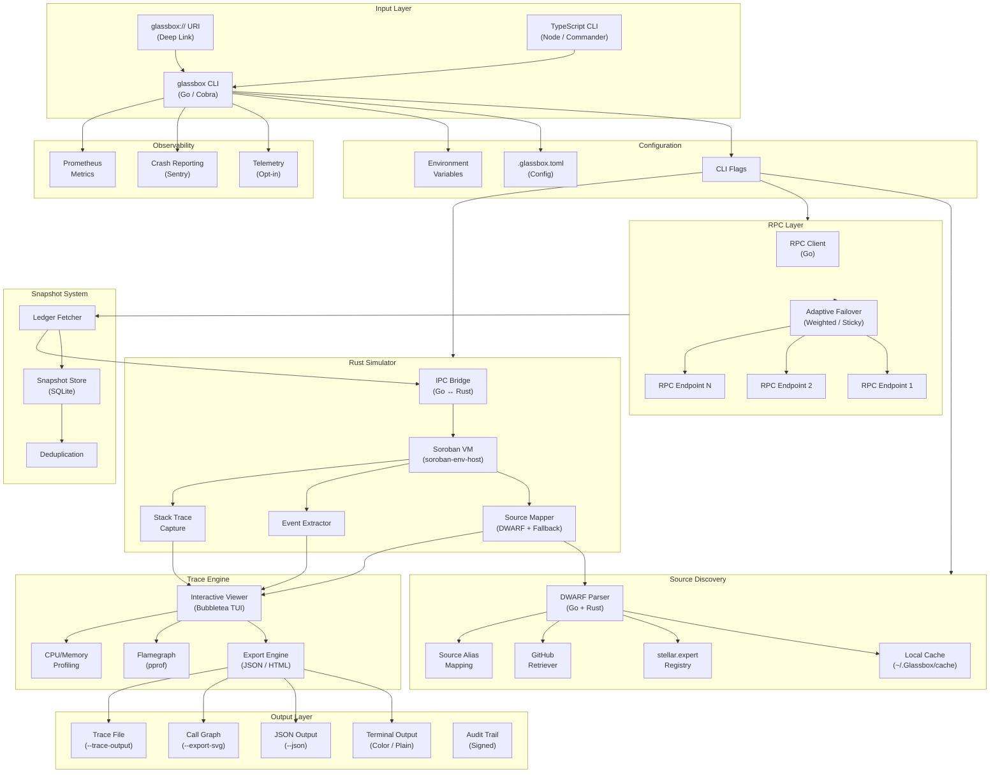
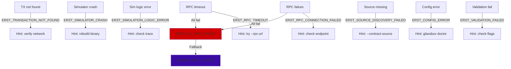
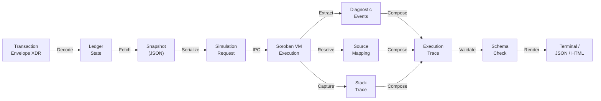
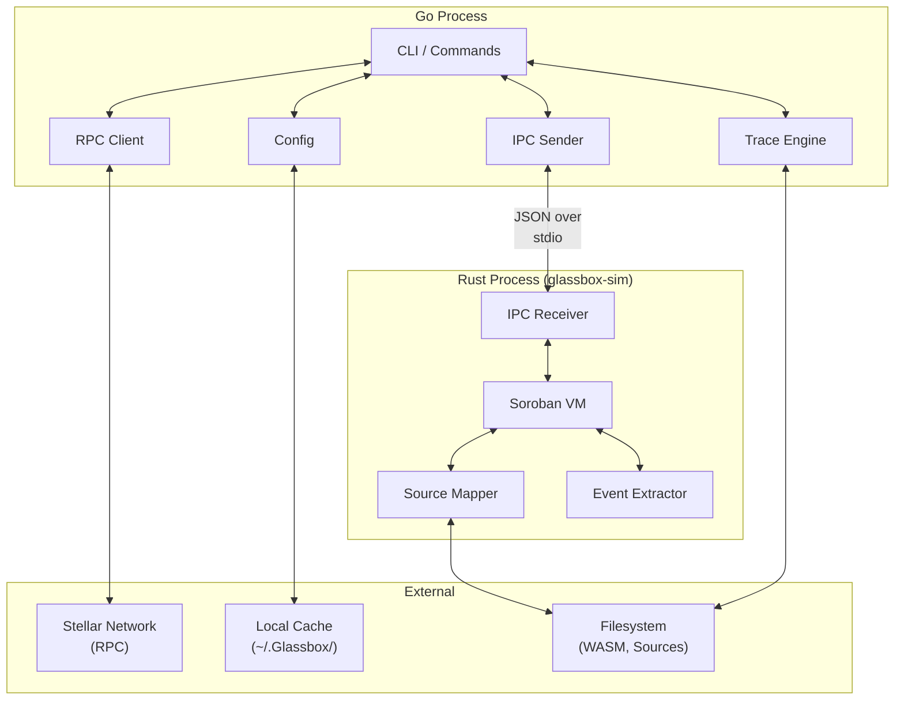

# Architecture Data-Flow Diagram

This document describes the end-to-end data flow through Glassbox, from user
input to final output. It identifies ownership, component boundaries, and
failure propagation paths.

## High-level data flow



## Component ownership

| Component | Package | Language | Responsibility |
|-----------|---------|----------|----------------|
| CLI framework | `cmd/glassbox`, `internal/cmd/` | Go | Argument parsing, flag validation, command dispatch |
| Deep link handler | `internal/deeplink/`, `internal/protocolreg/` | Go | Parse `glassbox://` URIs, register OS protocol handler |
| Configuration | `internal/config/` | Go | Load TOML config, env vars, flag merging |
| Source discovery | `internal/sourcemap/`, `internal/dwarf/`, `internal/cache/` | Go | DWARF parsing, cache, registry, GitHub fallback |
| RPC client | `internal/rpc/` | Go | Adaptive failover, endpoint health tracking |
| Snapshot system | `internal/snapshot/`, `internal/db/` | Go | Ledger state capture, SQLite storage, deduplication |
| IPC bridge | `internal/ipc/`, `internal/bridge/` | Go ↔ Rust | Request/response serialization, process management |
| Soroban VM | `simulator/src/vm.rs`, `simulator/src/host.rs` | Rust | Contract execution via `soroban-env-host` |
| Source mapper | `simulator/src/source_mapper.rs` | Rust | DWARF resolution, fallback pipeline |
| Event extractor | `simulator/src/events.rs` | Rust | Diagnostic and contract event capture |
| Stack trace | `simulator/src/stack_trace.rs` | Rust | WASM stack trace capture on traps |
| Trace viewer | `internal/trace/` | Go | Interactive TUI with search, navigation |
| Export engine | `internal/trace/` | Go | JSON, HTML, SVG trace export |
| Profiling | `internal/profile/` | Go | CPU/memory flamegraph via pprof |
| Telemetry | `internal/telemetry/` | Go | Opt-in, privacy-sanitized usage data |
| Crash reporting | `internal/crashreport/` | Go | Sentry integration, custom crash endpoint |
| Metrics | `internal/metrics/` | Go | Prometheus metrics for RPC health |
| TypeScript CLI | `src/` | TypeScript | Node.js CLI layer, Commander.js |
| VS Code extension | `vscode-extension/` | TypeScript | Editor integration |

## Synchronous vs asynchronous boundaries

```mermaid
flowchart LR
    subgraph Sync["Synchronous"]
        A["CLI dispatch"] --> B["Flag validation"]
        B --> C["Config load"]
        C --> D["Source discovery"]
        D --> E["RPC fetch"]
    end

    subgraph Async["Asynchronous"]
        E --> F["IPC request"]
        F --> G["VM execution"]
        G --> H["Event collection"]
        H --> I["Source mapping"]
    end

    subgraph Callback["Callback / Stream"]
        I --> J["Trace rendering"]
        J --> K["Export write"]
    end

    style Sync fill:#1a1a2e,stroke:#4cc9f0
    style Async fill:#1a1a2e,stroke:#f72585
    style Callback fill:#1a1a2e,stroke:#7209b7
```



**Synchronous:** Flag validation, config loading, source discovery, and RPC
fetch happen sequentially before any simulation begins. Failures are immediate
and return `ErstError` with a stable code.

**Asynchronous:** The IPC request to the Rust simulator, VM execution, and
event collection happen in a subprocess. The Go process reads stdout for
structured JSON responses.

**Callback/stream:** Trace rendering and export happen after simulation
completes. The interactive viewer uses Bubbletea's event loop for real-time
updates.

## Failure propagation



Every failure path produces a structured `ErstError` with:
- **Code**: stable string for automation (e.g. `RPC_CONNECTION_FAILED`)
- **Message**: human-readable description
- **Hint**: actionable remediation

See [stable-error-codes.md](./stable-error-codes.md) for the full catalogue.

## Data transformation pipeline



| Stage | Input | Output | Package |
|-------|-------|--------|---------|
| Decode | Envelope XDR (base64) | Go structs | `internal/rpc/` |
| Fetch | Transaction hash | Ledger entries | `internal/rpc/` |
| Snapshot | Ledger entries | JSON file | `internal/snapshot/` |
| Serialize | Go structs | JSON request | `internal/ipc/` |
| Execute | JSON request | VM state + events | `simulator/src/` |
| Extract | VM state | DiagnosticEvent[] | `simulator/src/events.rs` |
| Resolve | WASM address | SourceLocation | `simulator/src/source_mapper.rs` |
| Capture | VM stack | StackFrame[] | `simulator/src/stack_trace.rs` |
| Compose | Events + locations + frames | ExecutionTrace | `internal/trace/` |
| Validate | ExecutionTrace | Schema-valid trace | `internal/trace/` |
| Render | Valid trace | Terminal/JSON/HTML | `internal/trace/` |

## Component boundaries



**Boundary rules:**
- Go and Rust communicate exclusively via **JSON over stdin/stdout** (IPC).
- The Rust simulator is a **stateless subprocess** — it receives a request and
  returns a response.
- Source mapping in Go handles **discovery and caching**; the Rust side handles
  **DWARF resolution** during execution.
- All network I/O happens in Go; the Rust process is offline-only.

## Updating this diagram

When adding or modifying IPC messages, schema fields, or component boundaries:

1. Update the relevant Mermaid diagram section above.
2. Ensure diagram terminology matches code (package names, struct names).
3. Include the diagram in architecture review checklists for PRs that change
   IPC or schema contracts.
4. Run `mermaid-cli` locally to validate rendering:
   ```sh
   npx @mermaid-js/mermaid-cli mmdc -i docs/architecture-dataflow.md -o /dev/null
   ```

## See also

- [Trace schema](./schema/trace-schema.md) — execution trace formal specification
- [Schema registry](./schema/README.md) — JSON Schema definitions
- [Debug command](./debug-command.md) — CLI reference
- [Source mapping](./source-mapping.md) — DWARF resolution pipeline
- [Stable error codes](./stable-error-codes.md) — error code catalogue
- [Diagnostics bundle](./diagnostics-bundle.md) — portable diagnostics
- [Operator runbook](./operator-runbook.md) — symptom-based troubleshooting
